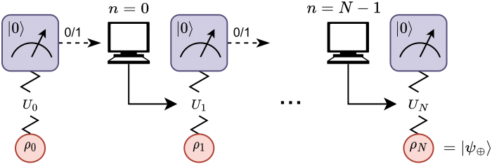
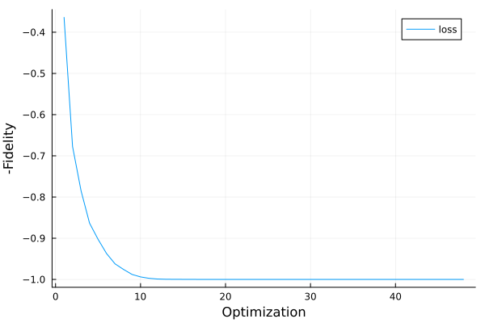
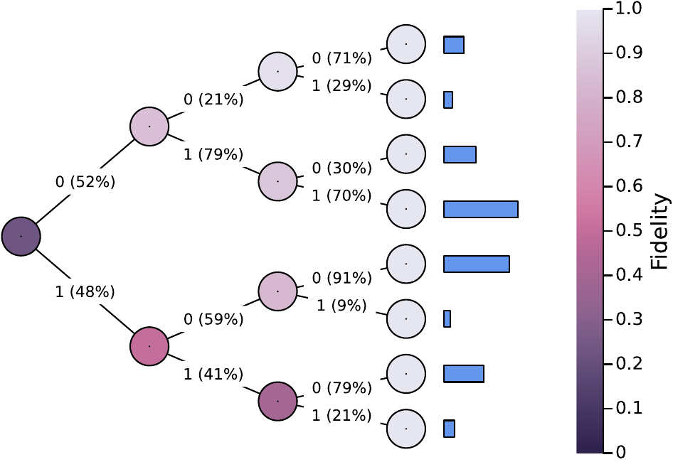
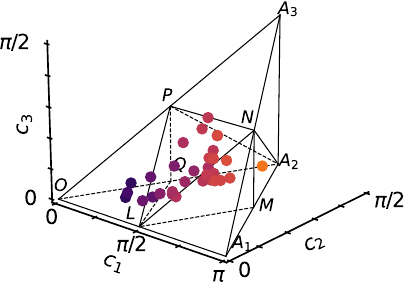

## **M**easurement-**I**nduced **Q**uantum **S**teering with Feed**back**

<p align="center">

</p>


This code accompanies the paper "Feedback-Steering for Quantum State Engineering" at [IEEE International Conference on Quantum Computing and Engineering 2023 (QCE23)](https://qce.quantum.ieee.org/)

We use:
- [Tullio](https://github.com/mcabbott/Tullio.jl) as a powerful and flexible einsum macro
- [Zygote](https://github.com/FluxML/Zygote.jl) for automatic differentiation 
- [Optim](https://github.com/JuliaNLSolvers/Optim.jl) for multivariate optimization

### TL;DR:

**Goal**: Start from an arbitrary (unknown) initial state and prepare a desired state.

**Protocol**: We achieve this by taking advantage of the back-action induced via measurement of an entangled state, termed as _measurement-induced steering_. The entanglement is achieved by applying gates. The qubit(s) we are measuring must reinitialize to a known state after each measurement. As we repeat this process, the remaining coupled qubit(s) are prepared to the desired state.

**Knobs**: We can change the gates, change the number of repetitions, and view the measurement results. 

### Getting Started

Install [Julia](https://julialang.org/) (at least v1.8) and clone repo

```git clone https://github.com/RustyBamboo/MIQSback.jl```

Then run `julia` and activate the package

```] activate .```

### Examples

Import the libraries

```julia
using MIQSback
using Plots
using LinearAlgebra
```

Declare the system to have two qubits: one we measure, and one which we wish to prepare in a target state. 

```julia
system = MIQSback.System(2,2)
target = [1.0+0im 1]' / sqrt(2)
```

Optimize the gates used. Assume 3 iterations of the protocol (i.e. we conduct 3 measurements). Also plot the optimization history.

```julia
iter = 3
sol, loss_history =  MIQSback.opt_vs_iter(system, target, iter, 0)
plot(loss_history)
```

Visualize the state evolution in a binary tree, where we start from an arbitrary initial state

```julia
rho_i = [3.0 + 0im; -10.1]
rho_i = rho_i / norm(rho_i)
rho_i = rho_i * rho_i'

fidelity = MIQSback.get_history(system, target, sol, 0, rho_i)
prob = MIQSback.get_prob_history(system, target, sol, 0, rho_i)

MIQSback.plot_tree(fidelity, prob, iter)
```

The loss history from optimization:



The binary tree representing the evolution of the state after each measurement:



The representation of gates in the Weyl chamber:

